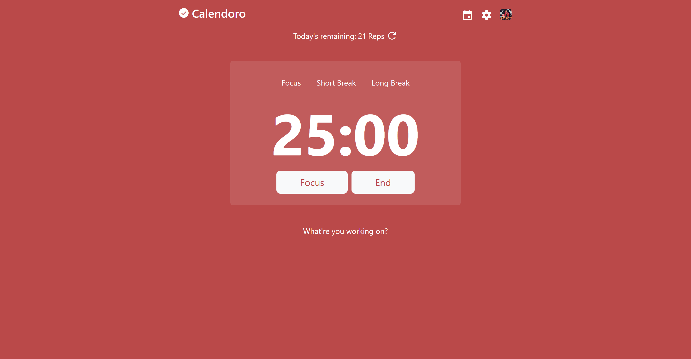

<!-- Improved compatibility of back to top link: See: https://github.com/othneildrew/Best-README-Template/pull/73 -->

<!--
*** Thanks for checking out the Best-README-Template. If you have a suggestion
*** that would make this better, please fork the repo and create a pull request
*** or simply open an issue with the tag "enhancement".
*** Don't forget to give the project a star!
*** Thanks again! Now go create something AMAZING! :D
-->

<!-- PROJECT SHIELDS -->
<!--
*** I'm using markdown "reference style" links for readability.
*** Reference links are enclosed in brackets [ ] instead of parentheses ( ).
*** See the bottom of this document for the declaration of the reference variables
*** for contributors-url, forks-url, etc. This is an optional, concise syntax you may use.
*** https://www.markdownguide.org/basic-syntax/#reference-style-links
-->
[![Contributors][contributors-shield]][contributors-url]
[![Forks][forks-shield]][forks-url]
[![Stargazers][stars-shield]][stars-url]
[![Issues][issues-shield]][issues-url]
[![MIT License][license-shield]][license-url]
[![LinkedIn][linkedin-shield]][linkedin-url]

<!-- PROJECT LOGO -->
 

  

<h3 align="center">Calendoro</h3>

  

    Pomodoro/Animedoro timer that based on your calendar to decide on learning goal for the day.
     
    <a href="https://github.com/lethanksbinh/Calendoro"><strong>Explore the docs »</strong></a>
     
     
    <a href="https://github.com/lethanksbinh/Calendoro">View Demo</a>
    ·
    <a href="https://github.com/lethanksbinh/Calendoro/issues">Report Bug</a>
    ·
    <a href="https://github.com/lethanksbinh/Calendoro/issues">Request Feature</a>
  

<!-- TABLE OF CONTENTS -->

  
Table of Contents

  <ol>
    <li>
      <a href="#about-the-project">About The Project</a>
      <ul>
        <li><a href="#built-with">Built With</a></li>
      </ul>
    </li>
    <li><a href="#license">License</a></li>
  </ol>

<!-- ABOUT THE PROJECT -->
## About The Project

There are many great Pomodoro timer software available online; however, I didn't find one that really suited my needs so I created this enhanced one. I want to create a Pomodoro/Animedoro timer app of my own so I can change the rules easily and add features of my interest.

Unique features:
- Timer after reaching 0 will keep counting as long as user wanted, bonus work will be recorded. This will allow users to keep the work flow or get the job done without having to start the next focus section.
- User can login and connect to Google Calendar to set today's goal base on the total events' duration. This way, users can be more flexible with their time while still getting the goal completed. Or they can have a reality check :).

I still have a few more ideas but let just end here for now. 

(<a href="#readme-top">back to top</a>)

### Built With

* 
* 
* 
* 
* 

(<a href="#readme-top">back to top</a>)

<!-- LICENSE -->
## License

Distributed under the MIT License. See `LICENSE.txt` for more information.

(<a href="#readme-top">back to top</a>)

<!-- MARKDOWN LINKS & IMAGES -->
<!-- https://www.markdownguide.org/basic-syntax/#reference-style-links -->
[contributors-shield]: https://img.shields.io/github/contributors/lethanksbinh/Calendoro.svg?style=for-the-badge
[contributors-url]: https://github.com/lethanksbinh/Calendoro/graphs/contributors
[forks-shield]: https://img.shields.io/github/forks/lethanksbinh/Calendoro.svg?style=for-the-badge
[forks-url]: https://github.com/lethanksbinh/Calendoro/network/members
[stars-shield]: https://img.shields.io/github/stars/lethanksbinh/Calendoro.svg?style=for-the-badge
[stars-url]: https://github.com/lethanksbinh/Calendoro/stargazers
[issues-shield]: https://img.shields.io/github/issues/lethanksbinh/Calendoro.svg?style=for-the-badge
[issues-url]: https://github.com/lethanksbinh/Calendoro/issues
[license-shield]: https://img.shields.io/github/license/lethanksbinh/Calendoro.svg?style=for-the-badge
[license-url]: https://github.com/lethanksbinh/Calendoro/blob/master/LICENSE.txt
[linkedin-shield]: https://img.shields.io/badge/-LinkedIn-black.svg?style=for-the-badge&logo=linkedin&colorB=555
[linkedin-url]: https://linkedin.com/in/linkedin_username
[product-screenshot]: images/screenshot.png
